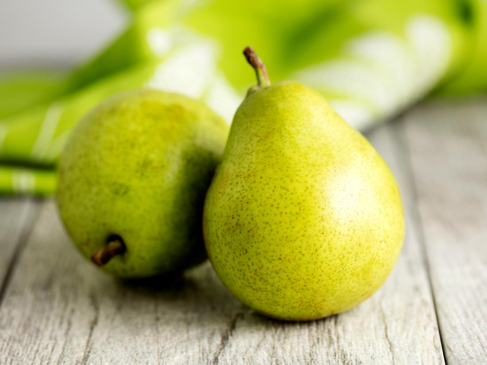

Fruits
======

This is a highly explanatory and beginner-friendly example of web implementation. 
Even though it’s a little silly, it explains the workflow and basic process of implementation quite well.

============
General idea
============

We begin by creating an overview of the idea. For this example, the vision is to implement the 
possibility of allocating fruit to the users on the website. 
Before we begin writing any code we must think about the general properties of a fruit, given the context.

So, generally we want to create a fruit object described by the two parameters name, a string, and isMoldy, 
a boolean. The fruit is connected to a user of whom it’s owned by. A user can own many fruits, but a fruit 
cannot be shared between users. These kinds of relations are important to keep track of. 

===================
Create a git branch
===================

Before actually writing any code, you must create a git branch so as to not accidentally mess with any 
other code (and especially not with the master branch). It is praxis to name it using kebab case in a manner 
of **[your name]-[general description]**. We create a new git branch through the command

::

	git checkout -b “johanna-fruits-example”

you can then make sure you are on the right branch through the command

::

	git status

or

::

	git branch

====================
Migrate the database
====================

For each Rails object, there is a database table. We go to **web/db/** and create a new file called 
**20201129220000_create_fruits.rb** as we are about to create a database for the fruits on 29 November 2020 at 10 pm. 
This naming convention exists to structure the files according to their creation. 

Here we will specify what parameters there are.

	.. code-block:: ruby

		class CreateFruits < ActiveRecord::Migration[5.0]
			def change
				create_table :fruits do |t|
					t.references :user
					t.string :name, null: false
					t.boolean :isMoldy, null: false, default: false
				end
			end
		end

We are saying that each fruit inhabits a name and degree of moldiness, neither of which can be empty (null), 
and is connected to a certain user. We have set the default value of isMoldy to false, as we would expect 
a new fruit to be fresh.

When this is finished we go to the terminal and run

::

	rails db:migrate

==============
Create a model
==============

This time the file and class name are singular, as opposed to the database elements that are plural. 
We go to **web/app/models/** and create a new file called **fruit.rb**.

	.. code-block:: ruby

		class Fruit < ApplicationRecord
	  	belongs_to :user, required: true
		  validates :name, presence: true
		  validates_inclusion_of :isMoldy, in: [true, false]

	  	def to_s
	   		name
	  	end
		end

Here we once again see the different parameters. The model is used to make sure that the right 
values go into the fruits’ database table. 

First we specify the relation between a user and a fruit; since we wish the user to own fruits, 
and a fruit to be owned by a single user, we use the line ``belongs_to`` which describes it quite well. 
``belongs_to`` is an Association that makes the creation and deletion of objects smoother. 

The ``validates :name, presence true`` line ensures that a fruit only can be created if it is given a name. 
Same goes for ``isMoldy``. But how come we don’t write validates ``:isMoldy, presence: true``? Doing so will 
lead to some bugs when creating a fruit. Read the documentation for ``validates``:

*If you want to validate the presence of a boolean field (where the real values are true and false), 
you will want to use validates_inclusion_of :field_name, in: [true, false].*

*This is due to the way Object#blank? handles boolean values: false.blank? # => true.*

Lastly there is the ``to_s`` function, which is quite self explanatory.

=================================================
Test the model directly through the Rails console
=================================================

At this point the fruit is practically done, console-wise. It is very practical to continuously try 
out an object directly through the Rails console while it is being implemented. Run

::

	rails c

to enter the Rails console. We copy the situation in the illustration above by running

::

	Fruit.create!(user_id: 1, name: “Banana”, isMoldy: false)

and

::

	Fruit.create!(user_id: 1, name: “Apple”, isMoldy: true)

The user with user_id: 1 (Hilbert Admin-älg) now owns two fruits. You can run 

::

	Fruit.all

to ensure that it is a list containing two fruits with the correct parameters. To delete these fruits we run 

::

	Fruit.delete_all

==========================
Add an association to user
==========================

We have already declared the Association belongs_to for the fruit, but we also need to declare a related 
Association for the user. We go to **web/app/models/user.rb** and write the following line

	.. code-block:: ruby

		has_many :fruits, dependant: :destroy

which, of course, says that a user can own many fruits. The ``dependant: :destroy`` bit is what ensures 
that all associated fruits will vanish as the user is deleted. If we go back to the Rails console, 
we can try out some new things. This time we will create the same fruits, but instead of having the 
user_id as a parameter, we will create the fruits directly through the user

::

	User.first.fruits.create!(name: “Banana”, isMoldy: false)
	User.first.fruits.create!(name: “Apple”, isMoldy: true)

Then calling 

::

	User.first.fruits

will return a list of these two fruits. We write ``User.first`` since we want to reach the first element 
in the list of users. Writing ``User.find(1)`` returns the user with id = 1, and is equivalent to ``User.first``.

=================
Define the routes
=================

In order for the fruits to show up on the website, the different routes have to be initialized in 
the file **web/app/config/routes.rb**. Before adding any code we have to be sure about who is supposed to 
have access to what. For this example we would like each user to be able to view their own fruits, 
and only admins to be able to create and delete fruits. We will therefore write

	.. code-block:: ruby

		resources :fruits, path: :frukter, only: [:index, :show]

		namespace :admin do
			resources :fruits, path: :frukter, except: :show
		end

We can view all the available fruit-paths by running 

::

	rails routes | grep fruit

If we were to run rails routes only we would get an endless stream of every single route. 

======================
Create the controllers
======================

The admin controller
--------------------

As we have specified that there are going to be different routes for admins and regular users, there has 
to be different controllers for each. We begin by writing the admin controller. We go to **web/app/controllers/admin/** 
and create a file **fruits_controller.rb**. The convention here is to name the file in plural. The “shell” of the file 
looks like this:

	.. code-block:: ruby

		class Admin::FruitsController < Admin::BaseController
			load_permissions_and_authorize_resource

			[methods]

		end

The class is also named in plural, and doing so has the benefit of automating some default routes. As you might have 
figured out, the **FruitsController** inherits from the **Admin BaseController**. You can view its contents at 
**web/app/controllers/admin/base_controller.rb**, if you’re curious.

In the controller we write methods that will be used to execute actions concerning the fruit. What actions do we want 
admins to be able to perform?

* Retrieve all existing fruits
* Create a new fruit
* Edit a fruit
* Delete a fruit

The control methods are quite standard, so let’s take a look at the finished file and then analyze its contents.

	.. code-block:: ruby

		class Admin::FruitsController < Admin::BaseController
			load_permissions_and_authorize_resource

			def index
				@fruits = initialize_grid(Fruit)
			end

			def create
				@fruit = Fruit.new(fruit_params)
				if @fruit.save
					redirect_to(admin_fruits_path, notice: alert_create(Fruit))
				else 
					render :new, status: 422
				end
			end

			def update
				if @fruit.update(fruit_params)
					redirect_to(edit_admin_fruit_path(@fruit), notice: alert_update(Fruit))
				else
					render :edit, status: 422
				end
			end

			def destroy
				@fruit.destroy!

				redirect_to(admin_fruits_path, notice: alert_destroy(Fruit))
			end

			private

			def fruit_params
				params.require(:fruit).permit(:name, :isMoldy, :user_id)
			end

		end

Let’s go back to the bullet list from before and match it with the corresponding methods:

* Retrieve all existing fruits - *index*
* Create a new fruit - *new and create (and fruit_params)*
* Edit a fruit - *edit and update*
* Delete a fruit - *delete*

Standard control methods
************************

But wait, how can there be new and edit methods if we haven’t implemented them ourselves? The way Rails works enables 
us to leave methods empty if we don’t want it to do something special. Rails, by standard, renders the 
corresponding view (we’ll get to that later) when a method is called; so calling edit will in this case 
render **web/app/views/edit.html.erb** and nothing else.

The @fruits variable
**********************

``index`` initialize the variable ``@fruits``. As for edit, ``index`` and  will render its corresponding 
views, but with the difference that we have made ``@fruits`` accessible in 
there. For ``update`` and ``delete``, it is possible to use the ``@fruit`` variable without initializing it as the 
preceding action (e.g. pressing a button) itself will “retrieve and send” the fruit object in question.

The create method
*****************

To create a new fruit, we begin by calling new which initializes the object. 
The parameters are then set and sent to the ``create`` method wherein the object is saved. The ``save`` method is 
inherited from **ActiveRecord Base** (follow the inheritance line of our model **fruit.rb**!), and is what adds a new 
fruit model to the database table. The method returns either ``true`` or ``false`` depending on its success. 
(The process is the same for ``edit`` and ``update``!)

**Try it out!**
What happens when running ``Fruit.new`` in the Rails console? What happens when running 
``Fruit.new(id: 100, user_id: 1, name: “Orange”, isMoldy: true)``? Do these commands affect the 
outcome of ``Fruit.all``? Try instead running ``Fruit.new(id: 100, user_id: 1, name: “Orange”, isMoldy: true).save``, 
and see what happens :-).

redirect_to
***********

We see that ``create``, ``update`` and ``delete`` methods all have incorporated the ``redirect_to`` method. As the name suggests 
it redirects to a certain page. The first parameter points to the end destination and the second renders a flash 
message on the screen. These “end destinations” are accessed through the paths you see when running 

::

	rails routes | grep fruit

The edit path has ``(@fruit)`` at its end since the path is specific to each fruit, 
fsektionen.se/admin/frukter/[fruit_id]/redigera*, as one edits one fruit at a time. ``admin_fruits_path`` 
on the other hand refers to all fruits and takes you to fsektionen.se/admin/frukter*. Remember how we named this url 
path “frukter”? (Scroll up!)

fruit_params
************

Lastly, there is the fruit_params method. The contents of this method whitelists the attributes that are allowed to be 
saved. We have defined that ``:fruit`` is a required attribute, while the rest are optional. This was introduced to Rails 
as a security feature. ``fruit_params`` checks if ``params[:id]`` exist and then return a params hash with the given, accepted, 
attributes if it does.

The "regular" controller
------------------------

This controller will be found in **web/app/controllers/fruits_controller.rb**. Since the explanations above were 
quite in-depth we’ll write out the complete controller directly:

	.. code-block:: ruby

		class FruitsController < ApplicationController

		  def index
		    @fruits = initialize_grid(current_user.fruits)
		  end

		  def show
		  	@fruit = Fruit.find(params[:id])
		  end
		end

Through the ``index`` method we want to retrieve all the fruits that belong to the user. We are able to do so using 
the ``includes`` method as we already have defined the relation between a user and their fruits with Associations.

================
Design the views
================

The views have already been mentioned quite a lot. If things feel a bit confusing right now, the views might help with the understanding. 
The views are found in **web/app/views/** and define the HTML styling of the fruits’ web pages. 

Admin view
----------

For the admin views we will create four files
* index.html.erb
* _form.html.erb
* new.html.erb
* edit.html.erb

The index, new and edit files all have corresponding control methods, meaning they are run as the web page is rendered. 
**_form** doesn’t have a corresponding control method, but will be used in the **new** and **edit** files. We create all these files 
in a new folder at **web/app/views/admin/fruits**.

Index
*****

This page will list all existing fruits in a table. As we initialized the variable ``@fruits = initialize_grid(Fruit)`` 
in the ``index`` method, we can easily create a table using the grid method.

	.. code-block::

		

		  

		    <h2><%= title(t('.new')) %></h2>
		  

		  <%= link_to(t('.new_fruit'), new_admin_fruit_path, class: 'btn primary')%>
		

		

		  

		    <h1><%= title(t('.title')) %></h1>
		  

		  

		    <%= grid(@fruits, hide_submit_button: true, hide_reset_button: true) do |g|
		      g.column(name: t('.user'), attribute: 'user_id') do |fruit|
		        fruit.user
		      end

		      g.column(name: t('.name')) do |fruit|
		        fruit.name
		      end

		      g.column(name: t('.mold')) do |fruit|
		        if fruit.isMoldy
		          t('.moldy_yes')
		        else
		          t('.moldy_no')
		        end
		      end

		      g.column(name: t('.edit')) do |fruit|
		        link_to(t('.edit_fruit'), edit_admin_fruit_path(fruit),
		                                     class: 'btn secondary')
		      end

		      g.column(name: t('.delete')) do |fruit|
		        link_to(t('.delete_fruit'), admin_fruit_path(fruit),
		                                     method: :delete,
		                                     data: {confirm: t('.confirm_delete')},
		                                     class: 'btn danger')
		      end
		    end %>

		    <button class="wg-external-submit-button btn primary" data-grid-name="grid">
		      <%= t('wice_grid.filter') %>
		    </button>

		    <button class="wg-external-reset-button btn secondary" data-grid-name="grid">
		      <%= t('wice_grid.reset_filter') %>
		    </button>
		  

		

You will notice throughout these files that there are code snippets of the form ``t(‘.something’)``. 
These are used in place of regular strings, e.g. ``“something”``, to enable Swedish and English translations. 
We will get to those later.

Code of the form ``<%= code %>`` are written in embedded Ruby, simply meaning we are embedding Ruby in an HTML file. 
An example of this is the aforementioned grid. In here we insert ``@fruits`` as a parameter. Then for each row ``g``, we 
define the content of each column. In the first column we put the fruit owner by calling ``fruit.user``. This column is 
unique for having ``attribute: ‘user_id’`` as a parameter, which will automatically render a field to filter the grid rows 
according to the user’s name.

The third and fourth columns link to ``edit`` and ``delete`` methods for the fruit respectively. For the delete link we must 
have ``method: :delete`` as a parameter to specify that we want to call the control method ``delete``. For ``edit`` we use the 
pre-existing path ``edit_admin_fruit_path(fruit)``.

The last two sections render buttons used to filter and reset filter respectively. Above the grid we also have a button 
for creating new fruit.

Form
****

The form is used both for creating and editing fruits. 

	.. code-block::

		<%= simple_form_for([:admin, fruit]) do |fruit|%>
		    <%= fruit.input :user_id,
		                label: t('.user'),
		                collection: User.by_firstname.confirmed,
		                input_html: { class: 'select2' },
		                include_blank: true, prompt: t('.user_prompt'),
		                label_method: :print_email %>
		    <%= fruit.input :name, label: t('.name')%>
		    <%= fruit.input :isMoldy, label: t('.mold'), as: :radio_buttons %>
		    <%= fruit.button :submit %> 
		    <%= link_to(t('.all'), admin_fruits_path, class: 'btn secondary') %>
		<% end %>

Using ``fruit.input`` we define what attributes we would like the form to ask for. ``fruit.button :submit`` renders a button 
the user is to press when done. The button label depends on the occurring action; if the form is used to create a fruit 
it will say “Skapa Frukt”, or to edit a fruit it will say “Uppdatera Frukt”.

Next to it there will be a button which redirects back to the fruit index page.

New
***

	.. code-block::

		

		  

		    <h1> <%= t('.title')%> </h1>
		  

		  <%= render 'form', fruit: @fruit %>
		

As mentioned, both **new** and **edit** will make use of the form. 

Edit
****

	.. code-block::

		

		  

		    <h1> <%= t('.title')%> </h1>
		  

		  <%= render 'form', fruit: @fruit %>
		

This file is identical to **new**.

Styling with CSS
****************

We implement CSS code in a new file **_fruits.scss** in  **web/app/assets/stylesheets/partials/**.

	.. code-block:: CSS

		.fruit-padding {
		  margin-bottom: 35px;
		}

In the index file we make use of ``fruit-padding`` in the very beginning. This simply adds a space below the top section.

User view
---------

Here we will create the views for the regular user.

Index
*****

Unlike the admin index view, we only list the fruits belonging to the current user. The grid will only have columns 
for the fruits’ names and moldiness. Additionally, we will link to each fruit’s show page.
 
	.. code-block::

		

		  

		    <h1><%= t('.title')%></h1>
		  

		  

		    <%= grid(@fruits, hide_submit_button: true, hide_reset_button: true) do |g|
		      g.column(name: t('.name'), attribute: 'id') do |fruit|
		        link_to(fruit.name, fruit_path(fruit))
		      end

		      g.column(name: t('.mold')) do |fruit|
		        if fruit.isMoldy
		        	t('.moldy_yes')
		        else
		        	t('.moldy_no')
		        end
		      end
		    end %>

		    <button class="wg-external-submit-button btn primary" data-grid-name="grid">
		      <%= t('wice_grid.filter') %>
		    </button>

		    <button class="wg-external-reset-button btn secondary" data-grid-name="grid">
		      <%= t('wice_grid.reset_filter') %>
		    </button>
		  

		

Show
****

On the show page we simply render the fruit’s name and a description of its moldiness.

	.. code-block::

		

		  

		    <h1> <%= @fruit.name%> </h1>
		  

		  <%= if @fruit.isMoldy
		  t('.moldy')
		  else
		  t('.notMoldy')
		  end -%>
		

======================
Write the translations
======================

Views
-----

	.. code-block:: YAML

		sv:
		  admin:
		    fruits:
		      index:
		        title: Alla frukter
		        name: Namn
		        mold: Möglig?
		        user: Ägare
		        edit: Redigera
		        edit_fruit: Redigera frukt
		        delete: Radera
		        delete_fruit: Radera frukt
		        confirm_delete: Vill du verkligen radera frukten?
		        new: Skapa ny frukt
		        new_fruit: Ny frukt
		        moldy_yes: Ja
		        moldy_no: Nej
		      edit:
		        title: Redigera frukt
		      new:
		        title: Ny frukt
		      form:
		        name: Namn
		        mold: Möglig?
		        user: Ägare
		        user_prompt: Välj användare
		        all: Alla frukter

	.. code-block:: YAML

		sv:
		  fruits:
		    index:
		      title: Dina frukter
		      name: Namn
		      mold: Möglig?
		      moldy_yes: Ja
		      moldy_no: Nej
		    show:
		      moldy: Den här frukten är möglig.
		      notMoldy: Den här frukten är fräsch.

	.. code-block:: YAML

		---
		en:
		  admin:
		    fruits:
		      index:
		        title: All fruits
		        name: Name
		        mold: Moldy?
		        user: Owner
		        edit: Edit
		        edit_fruit: Edit fruit
		        delete: Delete
		        delete_fruit: Delete fruit
		        confirm_delete: Are you sure you want to delete this fruit?
		        new: Create new fruit
		        new_fruit: New fruit
		        moldy_yes: "Yes"
		        moldy_no: "No"
		      edit:
		        title: Edit fruit
		      new:
		        title: New fruit
		      form:
		        name: Name
		        mold: Moldy?
		        user: Owner
		        user_prompt: Choose user
		        all: All fruits

	.. code-block:: YAML

		---
		en:
		  fruits:
		    index:
		      title: Your fruits
		      name: Name
		      mold: Moldy?
		      moldy_yes: "Yes"
		      moldy_no: "No"
		    show:
		      moldy: This fruit is moldy.
		      notMoldy: This fruit is fresh.

Model
-----

	.. code-block:: YAML

		sv:
		  activerecord:
		    models:
		      fruit:
		        one: Frukt
		        other: Frukter
		    attributes:
		      fruit:
		        user: Användare
		        name: Namn
		        isMoldy: Möglig?

	.. code-block:: YAML

		---
		en:
		  activerecord:
		    models:
		      fruit:
		        one: Fruit
		        other: Fruits
		    attributes:
		      fruit:
		        user: User
		        name: Name
		        isMoldy: Moldy?

===================
Admin dropdown menu
===================

Lastly, we would like there to be a link to the admin pages in the dropdown menu. We go to 
**web/app/views/layouts/dropdowns/_admin_dropdown.html.erb** and add ``Fruit`` to the ``Övrigt`` section.

	.. code-block:: ruby

		<% all_privileges = { 'Användare' => [User, MailAlias, Group, Permission],
		                      'Poster' => [Election, Council, Document],
		                      'Information' => [News, Event, BlogPost],
		                      'Spindelman' => [Menu, ShortLink, Constant, Category],
		                      'Pryl' => [Rent, Tool, Door, AccessUser, Key],
		                      'Övrigt' => [CafeShift, Introduction, Adventure, WorkPost, Faq, Page, Album, Contact, Meeting, Song, Fruit] } %>

=========
Read more
=========

* `Validations <https://guides.rubyonrails.org/active_record_validations.html>`_
* `Associations <https://guides.rubyonrails.org/association_basics.html>`_
* `Routes <https://guides.rubyonrails.org/routing.html>`_
* `Controllers <https://guides.rubyonrails.org/action_controller_overview.html>`_
* **`Inheritance in Rails Controllers <https://rmulhol.github.io/ruby/2015/04/27/solid-rails.html>`_
* `Rails rendering <https://www.rubyguides.com/2019/04/rails-render/>`_
* **`Parameters <https://www.rubyguides.com/2019/06/rails-params/>`_