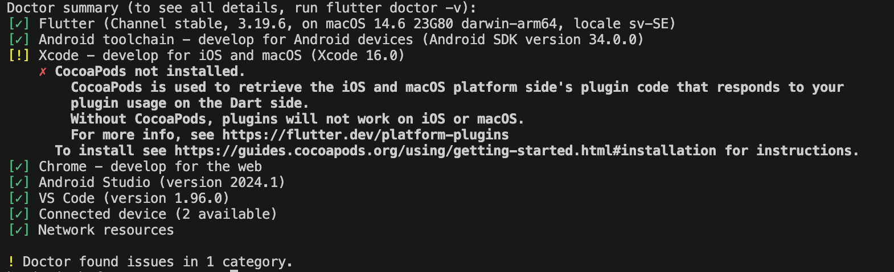

.. _app-installation-guide:

App Installation Guide
======================

=================================
Installing Flutter
=================================

The F-sektionen app is made with Flutter and Dart, so to get up and running we need to install the Flutter. Follow the links below and install the software if you haven't done so already.

 - `Flutter installation <https://docs.flutter.dev/release/archive>`_ - Install the correct version (3.19.6) and the right distro for your OS.

Do all the steps to install Flutter.

Try to run: ::

  flutter --version

If this doesn't work it is probably because your computer cannot locate the necessary files to run Flutter.

This can be fixed by making a directory where you put your installed programs and then add: ::

  export PATH="$PATH:$HOME/path-to-directory/flutter/bin"

to your paths.

Now it should work (check the step above again).

=================================
Installing Android Studio
=================================

For development on ``App2``, quite a few installments are needed and Android Studio is one of them.

 - `Android Studio installation <https://developer.android.com/studio>`_ 

In this app you can both get necessary SDK:s if something goes wrong and get different Android Emulators for easier development.

.. |rightarrow| unicode:: U+2192

To find the different emulators go to: Projects |rightarrow| Press the 3 dots in the right upper corner |rightarrow| Press Virtual Device Manager |rightarrow| Add whichever emulator you want.

=================================
Installing Xcode (macOS only)
=================================

Sadly, if you are using macOS you also need Xcode which can be install through ``App Store`` which should be pretty straight forward. You will probably never open this app but it is necessary for the App2 stack to work.

==============
Setting up Git
==============

We need to configure Git if you have not used it before. Run::

  git config --global user.name "Firstname Lastname"
  git config --global user.email email@example.com

using the same email as your account on GitHub.

We also recommended you to run the following command to simplify your pushes to git::

  git config --global push.default current

=============================
Cloning the Github repository
=============================

If you have never done this before, don't worry, it's fairly simple. You first need to navigate to your desired project location with the ``cd`` (change directory) command in the command line::

  cd <preferred project folder>

Then, when use the ``clone`` command with git, which downloads or *clones* the project from our repository on Github. So, we need to run::

  git clone https://github.com/fsek/App2.git

If you've done everything correctly you should see it start downloading files. After it's done you should have a new ``App2`` folder containg all the project files in the directory you chose.

==========================
Installing the environment
==========================

The first thing we need to do after cloning the project is to install the environment. First, enter the app directory with::

  cd App2

To start of check that: ::
  
  flutter doctor

Looks like this: (MacOS but similar on Windows and Linux)

This should only need to be run the first time and never again (mostly).

Now run: ::

  flutter pub get

In the root of your program.

After this run: ::

  flutter build apk

This may or may not work but it is most of the time not vital for the process to work.

Lastly run: ::

  flutter pub run build_runner build.

==================
Running the server
==================

After running the commands above you should start a emulator to see what is happening you can click the `No Device` button and choose one. If you don't have any good one installed you can look at Android Studio installment.
